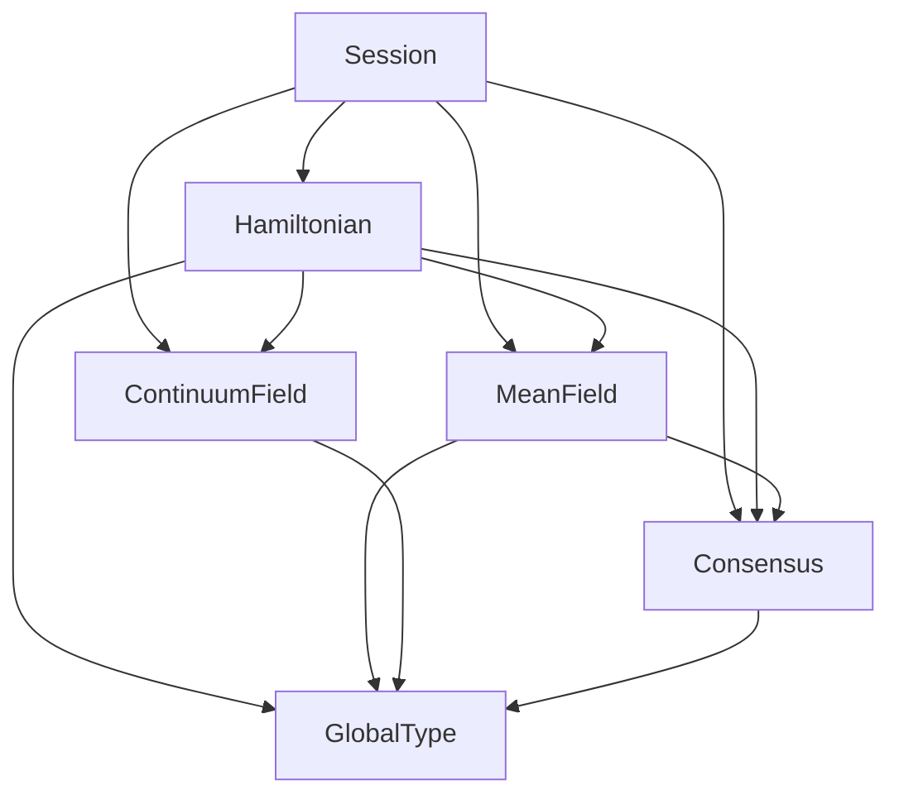

# Gibbs Overview

[Gibbs](https://github.com/hxrts/gibbs) is a Lean 4 formalization of statistical mechanics within a session-type choreography framework. It provides machine-checked proofs connecting Hamiltonian mechanics, population dynamics, continuum field theory, and distributed consensus through shared mathematical structures. The codebase depends on Mathlib for analysis and algebra, and on Telltale for session-type and effects infrastructure.

## Gibbs Modules

The project is organized into four modules that share a common foundation in `Session.lean`, which defines session identifiers, roles, endpoints, and directed communication edges. Each module builds on these primitives to formalize a different physical domain.

The diagram shows the dependencies between each module. Hamiltonian provides convex analysis and energy machinery used by MeanField, ContinuumField, and Consensus. MeanField provides order parameters and universality classes consumed by Consensus. Each module encodes its interactions as a Telltale `GlobalType`, the shared compilation target that connects physical dynamics to session-typed protocols.

The **Hamiltonian module** formalizes classical mechanics in finite-dimensional phase space. It covers separable convex Hamiltonians, damped and symplectic flows, Legendre and Bregman duality, the Fenchel-Moreau theorem, Gibbs ensembles, Shannon entropy, discrete channels, and stochastic dynamics. See [Hamiltonian Mechanics](02-hamiltonian-mechanics.md) and [Convex Duality and Bregman Divergence](03-convex-duality.md) for the theoretical background.

The **MeanField module** formalizes population dynamics over finite state spaces on the probability simplex. Drift functions are constructed compositionally from stoichiometric rules. ODE existence and uniqueness follow from Picard-Lindelöf, with Lyapunov and Hurwitz stability theory for equilibrium analysis. See [Mean-Field Dynamics](04-mean-field.md) for details.

The **ContinuumField module** lifts the discrete framework to spatially extended systems with nonlocal integral kernels. The central result is that global and local kernel operators are definitionally equal, proved by `rfl`. Spatial and temporal bridges connect continuous evolution to discrete protocol steps, with coherence conditions ensuring that distributed local computations reproduce the global operator exactly. See [Continuum Fields](05-continuum-field.md) for details.

The **Consensus module** specializes the physics machinery to distributed agreement. Executions, decisions, adversary models, quorum thresholds, and energy gaps are defined in terms of partition functions and interactive distances. See [Consensus as Statistical Mechanics](08-consensus-statistical-mechanics.md) for the theoretical synthesis.

## Proof Completeness

Two statements remain as Lean `axiom` declarations, both components of Shannon's noisy channel coding theorem. Their proofs require probabilistic combinatorics (random codebook generation, joint typicality, the method of types) that is beyond current Mathlib infrastructure. These axioms are collected in `Gibbs/Axioms.lean` and imported through the Hamiltonian facade, making them available to downstream modules. They are used only in `Gibbs/Consensus/ChannelThreshold.lean` to prove `codingSafe_iff_positive_gap`. Everything else is fully proven from Lean's type theory and Mathlib.

`channel_coding_achievability` says that for any rate below capacity and any target error probability, codes achieving that rate with error at most that target exist at all sufficiently large blocklengths.

`channel_coding_converse` says that for any rate at or above capacity, every code sequence has error probability approaching 1 as blocklength grows (the strong converse).

## Where to Start

- [Getting Started](01-getting-started.md) covers setup, building, and importing Gibbs.
- [The Session-Physics Correspondence](07-session-physics-correspondence.md) explains how session-type guarantees map to physical properties.
- [Hamiltonian Mechanics](02-hamiltonian-mechanics.md) introduces the phase-space foundation.
- [Convex Duality and Bregman Divergence](03-convex-duality.md) covers the convex analysis toolkit.
- [Mean-Field Dynamics](04-mean-field.md) covers population dynamics on the simplex.
- [Continuum Fields](05-continuum-field.md) covers spatially extended systems and nonlocal kernels.
- [Information Theory and Channels](06-information-theory.md) covers entropy, channels, and coding.
- [Consensus as Statistical Mechanics](08-consensus-statistical-mechanics.md) presents the deepest synthesis.

The full dependency tree with API tables per-file can be found in [Gibbs/CODE_MAP.md](https://github.com/hxrts/gibbs/blob/main/Gibbs/CODE_MAP.md).
