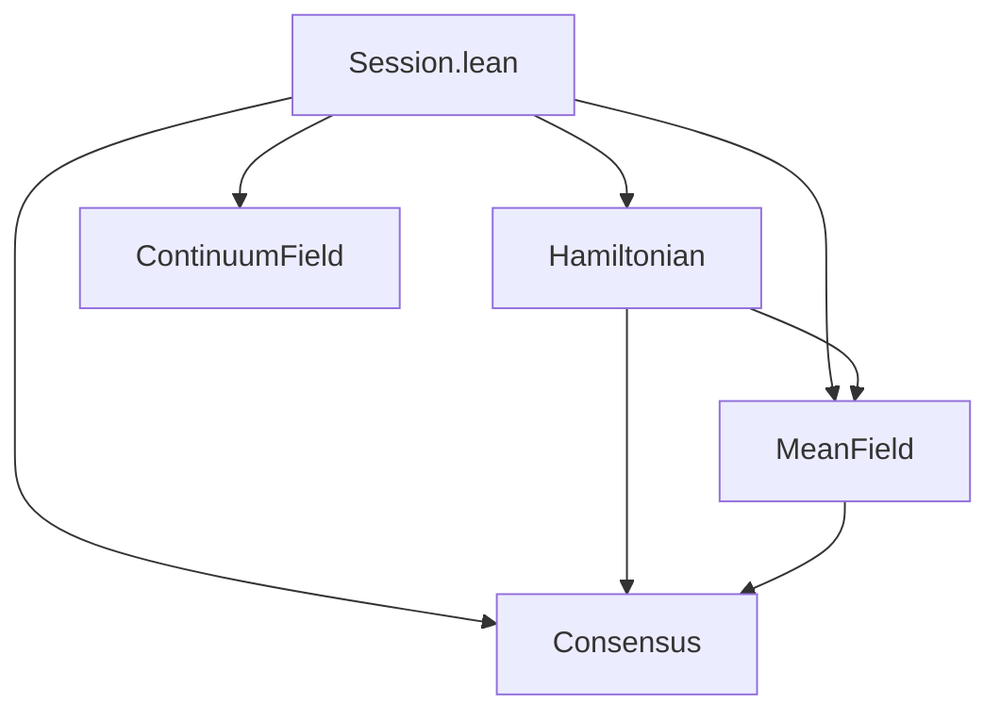

# Gibbs Overview

Gibbs is a Lean 4 formalization of statistical mechanics within a session-type choreography framework. It provides machine-checked proofs connecting Hamiltonian mechanics, population dynamics, continuum field theory, and distributed consensus through shared mathematical structures. The codebase depends on Mathlib for analysis and algebra, and on Telltale for session-type and effects infrastructure.

## The Four Layers

The project is organized into four layers that share a common foundation in `Session.lean`. That module defines session identifiers, roles, endpoints, and directed communication edges. Each layer builds on these primitives to formalize a different physical domain.

The diagram shows the dependency structure. Hamiltonian provides convex analysis and energy machinery used by MeanField and Consensus. MeanField provides order parameters and universality classes consumed by Consensus. ContinuumField is largely independent, connecting to the session layer through spatial kernel operators.

The Hamiltonian layer formalizes classical mechanics in finite-dimensional phase space. It covers separable convex Hamiltonians, damped and symplectic flows, Legendre and Bregman duality, the Fenchel-Moreau theorem, Gibbs ensembles, Shannon entropy, discrete channels, and stochastic dynamics. See [Hamiltonian Mechanics](02-hamiltonian-mechanics.md) and [Convex Duality and Bregman Divergence](03-convex-duality.md) for the theoretical background.

The MeanField layer formalizes population dynamics over finite state spaces on the probability simplex. Drift functions are constructed compositionally from stoichiometric rules. ODE existence and uniqueness follow from Picard-Lindelöf, with Lyapunov and Hurwitz stability theory for equilibrium analysis. See [Mean-Field Dynamics](04-mean-field-dynamics.md) for details.

The ContinuumField layer lifts the discrete framework to spatially extended systems with nonlocal integral kernels. The central result is that global and local kernel operators are definitionally equal, proved by `rfl`. Spatial and temporal bridges connect continuous evolution to discrete protocol steps.

The Consensus layer specializes the physics machinery to distributed agreement. Executions, decisions, adversary models, quorum thresholds, and energy gaps are defined in terms of partition functions and interactive distances. See [Consensus as Statistical Mechanics](06-consensus-statistical-mechanics.md) for the theoretical synthesis.

## Proof Completeness

There are no `sorry` axioms anywhere in the codebase. Several deep information-theoretic results are stated as Lean `axiom` declarations. These include the Shannon entropy Jensen bound, the data processing inequality, mutual information nonnegativity, BSC capacity formulas, and the Shannon coding theorems. All other proofs are concrete.

## Where to Start

- [Getting Started](01-getting-started.md) covers setup, building, and adding new modules.
- [The Session-Physics Correspondence](07-session-physics-correspondence.md) explains how session-type guarantees map to physical properties.
- [Hamiltonian Mechanics](02-hamiltonian-mechanics.md) introduces the phase-space foundation.
- [Convex Duality and Bregman Divergence](03-convex-duality.md) covers the convex analysis toolkit.
- [Mean-Field Dynamics](04-mean-field-dynamics.md) covers population dynamics on the simplex.
- [Information Theory and Channels](05-information-theory.md) covers entropy, channels, and coding.
- [Consensus as Statistical Mechanics](06-consensus-statistical-mechanics.md) presents the deepest synthesis.

The full dependency tree and per-file API tables are in `Gibbs/CODE_MAP.md`.
