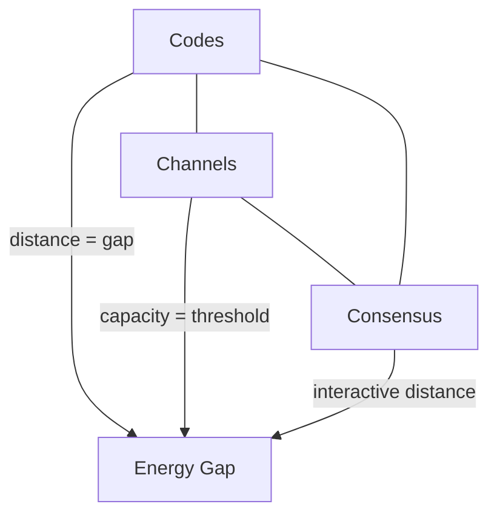

# Consensus as Statistical Mechanics

This document presents the synthesis at the heart of Gibbs: consensus protocols are statistical-mechanical systems. For the physical foundations, see [Hamiltonian Mechanics](02-hamiltonian-mechanics.md) and [Mean-Field Dynamics](04-mean-field-dynamics.md). For the information-theoretic bridge, see [Information Theory and Channels](05-information-theory.md).

## The Analogy

Consider a group of people trying to agree on a decision. Each person has an opinion and can talk to their neighbors, influencing them. The question is whether the group converges to a shared decision.

Now consider a magnet cooling from high temperature. Each atom has a spin (up or down) and interacts with its neighbors. Thermal noise randomly flips spins. The question is whether the spins align into a coherent magnetization.

These problems are analogous. In both cases, local interactions between agents produce (or fail to produce) global order. Interactions are local (message passing or spin coupling). There is noise (faults or thermal fluctuations). And the central question is identical: does macroscopic order emerge from microscopic dynamics?

The mathematics is isomorphic. A consensus protocol defines an energy landscape over possible execution histories, just as a Hamiltonian defines an energy landscape over spin configurations. Agreement is a low-energy state. Disagreement is high-energy. The question of whether consensus is achievable becomes the question of whether the system has a phase transition from disorder to order.

Because of this parallel, we can use well established machinery from physics to understand distributed systems, and visa-versa. For instance, the fault tolerance thresholds that appear in distributed consensus ($f < N/3$ for BFT, $f < N/2$ for static) represent phase boundaries. The distinction between deterministic and probabilistic finality maps to gapped vs gapless phases. And the impossibility results of distributed computing equate to thermodynamic laws.

## Agreement as Macroscopic Order

A distributed system of $N$ processes, each supporting a value $\sigma_i \in \{-1, +1\}$, has a natural order parameter:

$$m = \frac{1}{N} \sum_{i=1}^N \sigma_i$$

When $|m| \approx 0$, there is no consensus (disordered phase). When $|m| \approx 1$, strong consensus has formed (ordered phase). This is the same order parameter as the Ising model. Consensus corresponds to spontaneous symmetry breaking: the system collectively selects one of the two equivalent ordered states.

The `magnetization` function in `Consensus/OrderParameter.lean` computes this quantity. The `OrderParameter` structure wraps it as a state observable.

| Consensus Property | Physical Analogue |
|---|---|
| Agreement | All spins align to same direction |
| Validity | Chosen direction is $\pm 1$ (from allowed set) |
| Termination | System reaches ordered phase |
| Metastability | Partial consensus or local minima |
| Leader election | Nucleation (first supercritical nucleus wins) |

## Energy and the Partition Function

An effective Hamiltonian assigns an energy cost to each execution:

$$H(\omega) = H_{\text{conflict}}(\omega) + H_{\text{delay}}(\omega) + H_{\text{fault}}(\omega)$$

The conflict term penalizes disagreement. The delay term penalizes prolonged indecision. The fault term encodes adversarial behavior. Safety invariants correspond to forbidden regions where $H = +\infty$.

The `ConsensusHamiltonian` structure in `Consensus/Hamiltonian.lean` bundles these three components. The `forbiddenEnergy` function assigns $\infty$ to forbidden executions. The `energyWeight` function maps this to Boltzmann weights, with forbidden executions receiving weight zero.

The partition function sums Boltzmann weights over all admissible executions:

$$Z(\beta) = \sum_{\omega \in \Omega} e^{-\beta H(\omega)}$$

Free energy is $F = -\frac{1}{\beta} \log Z$. The parameter $\beta$ (inverse temperature) interpolates between analysis regimes. Taking $\beta \to \infty$ recovers worst-case (deterministic) analysis. Finite $\beta$ corresponds to average-case (randomized) analysis. The bounds `freeEnergy_le_minEnergy` and `minEnergy_le_freeEnergy_add` sandwich the free energy between $\min H$ and $\min H - (\log |\Omega|) / \beta$.

## Gap vs No Gap

The central dichotomy is whether a free-energy gap separates ordered from disordered macrostates.

A protocol has a safety gap at fault budget $b$ when the interactive distance between any good macrostate and any bad macrostate exceeds $b$:

$$\min_{M \in \text{Good},\; M' \in \text{Bad}} \Delta_H(M, M') > b$$

The interactive distance $\Delta_H(M, M')$ is the minimum corruption effort needed to move from an execution realizing $M$ to one realizing $M'$. This generalizes minimum code distance to the interactive setting.

When a gap exists, reversal probability decays exponentially: $P(\text{reversal}) \sim e^{-\Delta F}$. In the thermodynamic limit ($N \to \infty$), a positive gap makes reversal probability vanish. This is finality.

When no gap exists ($\Delta F = 0$), competing histories coexist at comparable free energy. Reorganizations remain possible. Safety violations have nonzero probability. This is probabilistic finality, where additional confirmations reduce but never eliminate the reversal risk.

## Universality Classes

Consensus protocols fall into three universality classes determined by their gap structure.

| Class | Gap | Finality | Examples |
|---|---|---|---|
| I: Gapless | No safety gap | Probabilistic only. Reversal probability decays geometrically with confirmation depth $k$ but never reaches zero. | Nakamoto |
| II: Gapped | Deterministic safety gap | Deterministic. Once a quorum certificate forms, alternative histories are forbidden. Gap scales with $N$. | BFT, PBFT, Tendermint |
| III: Hybrid | Fast path gapless, fallback gapped | Probabilistic fast path with deterministic BFT fallback. Rare violations possible in fast path. | Fast finality + BFT fallback |

The `classOf` function in `Consensus/UniversalityClasses.lean` classifies protocols based on gap and tunneling flags. Microstructural details differ across protocols within a class. Large-scale behavior does not.

## Thresholds as Phase Boundaries

The fault thresholds $f < N/2$ (static) and $f < N/3$ (interactive) are not protocol artifacts. They are phase boundaries in the thermodynamic limit.

For static decoding (error-correcting codes), the repetition code of length $N$ has distance $d_{\min} = N$. Unique decoding of $f$ errors requires $2f < N$, giving $N \geq 2f + 1$. The theorem `repetition_threshold` formalizes this.

For interactive decoding (consensus), quorum intersection provides the additional constraint. With quorum size $q = 2f + 1$ and $N = 3f + 1$:

$$|Q \cap Q'| \geq 2q - N = f + 1$$

Any two quorums overlap in at least $f + 1$ processes, ensuring at least one honest process in the intersection. The theorem `quorum_intersection_3f1` proves this. The gap collapses at $N = 3f$ (`quorum_gap_collapse`): the adversary can place all overlap inside Byzantine nodes.

In the thermodynamic limit, the normalized interactive distance $\delta(\alpha) = \liminf_{N \to \infty} \frac{1}{N} \min \Delta_H(\text{Good}, \text{Bad})$ is positive for $\alpha < 1/3$ and zero for $\alpha \geq 1/3$. The corruption fraction $\alpha = 1/3$ is a phase boundary.

## The Unifying Triangle

The deepest statement in the framework is that error-correcting codes, information-theoretic channels, and consensus protocols are three instantiations of the same mathematical structure.

Codes are non-interactive consensus (single sender, one round). Channels add noise statistics and rate-reliability tradeoffs. Consensus adds interaction and adaptive adversaries, tightening the threshold from $1/2$ to $1/3$.

In all three cases, the energy gap determines whether the system can reliably distinguish between macrostates. A positive gap means unique decoding, reliable communication, or deterministic finality. Zero gap means ambiguity, capacity violation, or impossibility.

This perspective explains why the thresholds are sharp, why they recur across fields, and why additional confirmations in Nakamoto consensus provide probabilistic but never deterministic safety.
