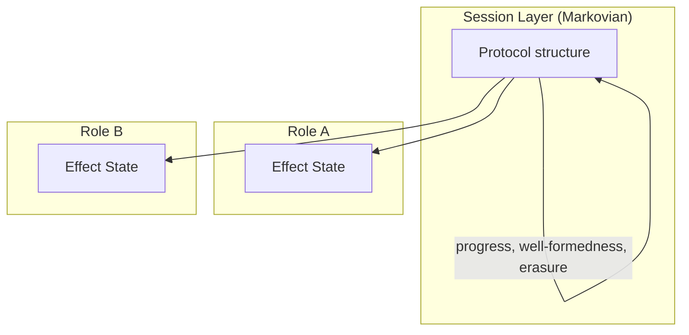

# The Session-Physics Correspondence

This document articulates the correspondence between session-type guarantees and physical properties in Gibbs. Session types provide structural guarantees about protocol execution. Each guarantee has a direct physical interpretation in terms of dynamics, conservation, and locality. For the physical layers, see [Hamiltonian Mechanics](02-hamiltonian-mechanics.md), [Mean-Field Dynamics](04-mean-field-dynamics.md), and [Consensus as Statistical Mechanics](06-consensus-statistical-mechanics.md).

## The Three Guarantees

Session types provide three fundamental guarantees. Each maps to a physical property that Gibbs formalizes.

| Session Property | Physical Property | Gibbs Implementation |
|---|---|---|
| Progress | Existence of dynamics | `global_ode_exists`, `simplex_forward_invariant` |
| Well-formedness | Conservation laws | `drift_sum_zero`, `KernelCoherent` |
| Erasure | Locality | `projectKernelAt`, local kernel environments |

Progress means the system never deadlocks. Every send finds a matching receive. The physical analogue is that the coupled ODE or PDE system always has a forward solution. The progress guarantee is the global existence theorem.

Deadlock corresponds to finite-time blowup or an ill-posed system. An unresolved dependency corresponds to a singular coupling or undefined drift.

Well-formedness means every send has a matching receive with compatible types. The physical analogue is conservation law preservation. A type mismatch corresponds to dimensional inconsistency. A well-formed message corresponds to a consistent coupling term.

On the probability simplex, the drift sums to zero. For continuum fields, local kernels are coherent projections of the global kernel.

Erasure means that if a role does not appear in a sub-protocol, its state is completely unaffected. The physical analogue is locality. A non-participant corresponds to an uncoupled field component whose dynamics are independent of the interaction. Protocol projection corresponds to kernel restriction. The function `projectKernelAt` gives each role only its local slice of the global kernel.

## Termination as Stability

Session termination, where all participants reach their `end` state, corresponds to asymptotic stability. The system converges to equilibrium.

A `StrictLyapunovData` structure captures this correspondence. The Lyapunov function $V$ is nonneg, zero at equilibrium, and tends to zero along trajectories. The theorem `strict_lyapunov_implies_asymptotic` shows this gives asymptotic stability. Protocol completion corresponds to $V \to 0$.

In Hamiltonian systems, the energy function serves as the Lyapunov function when damping is present ($dH/dt = -\gamma \|p\|^2 \leq 0$). In mean-field systems, the Bregman divergence to equilibrium serves the same role. In consensus, the free-energy gap determines whether termination (finality) is achievable.

## The Two-Level Architecture

Session types are Markovian by design. The protocol structure, sends, receives, and branches, carries no internal memory. Complex physics lives inside effect handlers attached to each role.

The session layer handles coordination. Effect handlers within each role carry memory, history, and non-Markovian internal dynamics. This separation keeps progress and deadlock proofs simple while allowing arbitrarily complex physics.

Memory scope is explicit. Each role declares what history it maintains. Approximations (discretization, mean-field closure, coarse-graining) are also explicit. Handlers declare truncation strategies and error bounds. Effects compose correctly across roles because the session layer enforces conservation and coherence at every interaction point.

## Modeling via Effects

Non-Markovian dynamics, stochastic forcing, and multi-body interactions require effect handlers that maintain internal state beyond what the Markovian session layer provides.

| System | Memory Structure | Effect Representation |
|---|---|---|
| Viscoelasticity | Prony series | `Memory (Fin n → ℝ)` for n modes |
| Retarded potentials | Fixed delay $\tau$ | `DelayLine τ` with circular buffer |
| Fractional diffusion | Power-law kernel | `FractionalDeriv α` |
| Hysteresis | Path-dependent | `Preisach` distribution |

Stochastic forcing uses a `Stochastic` effect providing Brownian increments and Poisson jumps.

## Semiclassical and Open Quantum Systems

A significant subset of quantum systems reduces to classical ODEs on finite-dimensional state spaces. The requirement is that quantum coherence either lives within a single role's internal state or has been averaged out via a mean-field or semiclassical limit.

| Quantum System | State Space | Dissipation Source |
|---|---|---|
| Lindblad (n-level) | $n \times n$ density matrices | Environment coupling |
| Bloch equations | Bloch sphere $S^2$ | Decoherence $\gamma$ |
| Lattice Gross-Pitaevskii | Finite-dim $\psi$ | Imaginary time or reservoir |
| Quantum optimal control | Classical control parameters | Cost functional |

Quantum mechanics within a role is unrestricted. A role's effect handler can maintain a density matrix, solve Schrödinger equations, or track entanglement internally. The restriction is on inter-role quantum correlations: the session layer is classical, so messages between roles carry classical data.

## Scope and Boundaries

Not all physical systems fit naturally into this framework. The determining factor is whether the system can be decomposed into identifiable roles with local state and classical communication.

Systems with a natural fit include mean-field models, reaction networks, coupled oscillators, and gradient flows on probability simplices. These have finite-dimensional state spaces, Lipschitz drifts, and local interactions.

Convex Hamiltonians with damping bridge naturally to the framework, as described in [Hamiltonian Mechanics](02-hamiltonian-mechanics.md). The mean-field drift is often a gradient flow of convex free energy: $dx/dt = -\nabla_W F(x)$. This is Hamiltonian structure in the Wasserstein geometry.

| System | Hamiltonian | Damping Source |
|---|---|---|
| Damped oscillator | $\frac{1}{2}(p^2 + \omega^2 q^2)$ | Friction $\gamma p$ |
| Molecular dynamics | $\sum \frac{1}{2} p_i^2/m + V(q)$ | Langevin thermostat |
| Heavy-ball optimization | $\frac{1}{2}\|p\|^2 + f(q)$ | Momentum decay |

Some systems require engineering effort but are not structurally excluded.

| System | Challenge | Approach |
|---|---|---|
| Gauge theories | Redundant degrees of freedom | Quotient types, gauge-fixing effects |
| n-body forces | Beyond pairwise | Multi-party sessions, sequential approximation |
| Integrable systems | Periodic, no convergence | Action-angle variables, periodic sessions |
| Unbounded memory | Infinite history | Truncation effects with error bounds |

## Structural Limitations

Structural mismatches arise from hard constraints in the framework, not from engineering difficulty.

| Limitation | Issue |
|---|---|
| Infinite dimensions | Mean-field uses `Fintype Q`. True infinite-dim requires function spaces. |
| Indistinguishable particles | Session roles must be identifiable. Bosons and fermions have no role identity. |
| Lipschitz regularity | Existence requires bounded derivatives. This excludes shocks, blowup, and turbulence. |
| Inter-role entanglement | Bell's theorem prohibits local hidden variables. Erasure is violated. |
| Holographic duality | Bulk and boundary are dual descriptions, not separable roles. |
| Topological field theories | No local degrees of freedom to assign to roles. |
| Critical phenomena | Fluctuations at all scales. Mean-field destroys structure. |
| Spin glasses | Exponentially many metastable states. Rugged landscapes. |
| Chaotic Hamiltonians | Non-convex, separatrices, Arnold diffusion. |
| Full QFT | Infinite-dimensional Hilbert space. Field quantization. |

Practical limitations (finite memory, numerical approximation) can be addressed with better engineering. Structural limitations (locality violation, infinite dimensions) cannot.

## The Reverse Direction

The correspondence runs in both directions. Physical systems provide analogues for distributed systems concepts.

Consensus corresponds to spontaneous symmetry breaking. Above the critical temperature, no consensus forms ($m = 0$). Below it, consensus emerges spontaneously ($m \to \pm m^*$).

Agreement maps to spin alignment. Validity maps to the chosen direction lying in the allowed set $\{+1, -1\}$. Termination maps to reaching the ordered phase.

Metastability in physics corresponds to partial consensus or local minima in distributed systems. Leader election corresponds to nucleation, where the first supercritical nucleus determines the outcome.

Safety corresponds to conservation laws and constraint preservation. Liveness corresponds to equilibration, mixing, and ergodicity. Asymptotic stability captures both: the system reaches equilibrium (liveness) without violating constraints along the way (safety).

## Eventual Consistency

Eventual consistency corresponds to diffusive relaxation. When updates stop, replicas converge like the heat equation $\partial T / \partial t = \kappa \nabla^2 T$ smooths temperature gradients. The convergence rate is $\sim e^{-\lambda_1 t}$ where $\lambda_1$ is the spectral gap of the diffusion operator.

The spectral gap is the consistency window. A larger gap means faster convergence to agreement. This connects to the stability theory in [Mean-Field Dynamics](04-mean-field-dynamics.md) where Hurwitz eigenvalue conditions control convergence rates.

## Consistency Levels

Consistency levels map to physical regimes. Causal consistency corresponds to relativistic causality. Strong consistency requires infinite propagation speed, which is non-physical.

| Consistency Level | Physical Analogue |
|---|---|
| Strong consistency | Infinite propagation speed |
| Linearizability | Newtonian instantaneous action |
| Sequential consistency | Well-defined causal order |
| Causal consistency | Relativistic causality |
| Eventual consistency | Diffusive equilibration |

Causal consistency is the maximum achievable in physics. Information cannot travel faster than light.

## The CAP Theorem in Physics

The CAP theorem has a physical analogue. You cannot simultaneously have instantaneous global equilibrium (C), continuous local dynamics (A), and finite propagation speed (P).

| Regime | Sacrifice | Keep |
|---|---|---|
| Thermodynamics (quasi-static) | A | C + P |
| Hydrodynamics (local equilibrium) | Global C | A + P |
| Newtonian gravity | P | C + A |
| Relativity | Instantaneous C | A + P |

## Further Correspondences

Vector clocks correspond to light cone causal structure. Quorum intersection corresponds to percolation and connected clusters. Byzantine fault tolerance corresponds to topological protection, where the system's resilience is a global property that cannot be defeated by local perturbations. Replication strategies correspond to statistical ensembles.

The deepest connection is that consensus is a phase transition. The decision emerges from local interactions just as magnetization emerges from spin flips. Protocol parameters (timeouts, quorum sizes) function like temperature and coupling strength. Tuning them determines whether consensus is achievable.

## Open Questions

Several directions remain unexplored.

1. Can physical stability proofs transfer to session liveness proofs?
2. When interactions have stochastic rates, does progress become progress in expectation?
3. What is the session analogue of non-equilibrium steady states?
4. Do gauge invariances correspond to session polymorphism?
5. Can renormalization group ideas inform choreographies at different scales?
6. How do we verify that memory truncation preserves physical properties?
7. Can engineered phase transitions guide the design of consensus protocols?
8. Can consistency-latency tradeoffs be quantified using physical principles?
